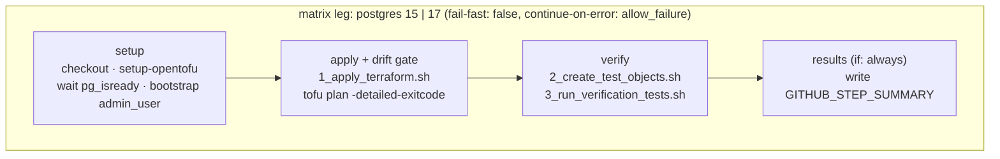

## Goal Capsule

- **Objective:** Add a GitHub Actions workflow that applies `examples/llm_chat_app` to a live Postgres 15 and a live Postgres 17. It fails on post-apply drift, runs the example's verification scripts, and reports results visibly without blocking merges.
- **Authority:** Product Contract (R-IDs) > Key Technical Decisions (KTD-IDs) > Implementation Units. Repo conventions in `.github/workflows/*.yaml` override this plan on style.
- **Guiding principle:** Let changes through; do not chase perfection. Developers must see failures, and they must always have an escape hatch to merge (R7, KTD9).
- **Stop conditions:** If a leg fails for a module or provider reason, do not fix the module in this work. File a module issue and use the KTD9 escape hatch for that leg. Stop and ask only if both legs fail for the same non-module reason (e.g., the workflow itself is broken).
- **Execution profile:** CI config and a one-line doc fix. Prove it with real workflow runs, not unit tests.

---

## Product Contract

### Summary

Add one workflow, `.github/workflows/integration-test.yaml`. Each matrix leg (Postgres 15, 17) starts a throwaway Postgres service container and bootstraps `admin_user`. It applies the example, checks for drift, then runs the verification scripts. A final step always writes a results summary.

### Problem Frame

The module is only verified by `tofu test` against locals and by manual local runs of the example. Nothing proves the grants work on a real server, and nothing proves they work across Postgres major versions. PG16 changed `CREATEROLE` semantics.
A non-superuser now needs `ADMIN OPTION` to grant membership in roles it did not create. A `CREATEROLE` creator also gets only `ADMIN` (not `SET`/`INHERIT`) on roles it creates, unless `createrole_self_grant` is set.
The example runs as a non-superuser (`superuser: false` in `examples/llm_chat_app/config.yaml`), so it sits directly on that behavior change.

### Requirements

- R1. CI applies `examples/llm_chat_app` against a live Postgres 15 server and a live Postgres 17 server on every relevant PR and on push to `main`.
- R2. CI runs the example's existing verification (`2_create_test_objects.sh`, `3_run_verification_tests.sh`) and fails the leg on any failing check.
- R3. CI fails a leg when a `tofu plan` run immediately after apply, before any test objects exist, reports changes.
- R4. A failure on one Postgres version does not cancel or hide the result of the other.
- R5. The workflow needs no repository secrets and grants the job only `contents: read`.
- R6. The `admin_user` bootstrap documented in `examples/llm_chat_app/config.yaml` matches the privileges CI grants.
- R7. A red integration test never blocks a merge, and every failure stays visible to the PR author.

### Scope Boundaries

- Not in scope: module code changes, a reusable workflow in `masterpointio/actions`, rewriting the bash checks as `tofu test`.
- CI proves behavior for a non-superuser `CREATEROLE` admin on vanilla Postgres. It approximates, but does not reproduce, an RDS master user (which is also a member of `rds_superuser`).

#### Deferred to Follow-Up Work

- Add Postgres 16 and 18 to the matrix.
- Teardown coverage (`tofu destroy`). This needs a `DROP OWNED BY role_service_migration` (or `REASSIGN OWNED`) step first. Otherwise `DROP ROLE` fails on the test objects, which is why `examples/llm_chat_app/4_cleanup.sh` exists.
- A second, post-fixtures `tofu plan` as an informational (non-blocking) drift report.
- Extract to a reusable workflow once a second module needs a live-Postgres test.

---

## Planning Contract

### Key Technical Decisions

- KTD1. Trigger on `pull_request`, `push: main`, and `workflow_dispatch`, not `pull_request_target`. (session-settled: user-approved — chosen over `pull_request_target`: no secrets are needed, so fork code runs without secret exposure and zizmor stays clean.) Governs R5.
- KTD2. Use a matrix over Postgres versions with `fail-fast: false` and a `postgres:<version>` service container on `5432:5432`.
  (session-settled: user-approved — chosen over testing latest only: 15 is pre-PG16 `CREATEROLE`, 17 is post.) The service sets `env: POSTGRES_PASSWORD: postgres` (the image will not start without it) and `options: --health-cmd pg_isready --health-interval 5s --health-timeout 5s --health-retries 10` so steps wait for a ready server.
  Governs R1, R4.
- KTD3. Reuse the example scripts unchanged. Call the numbered scripts individually instead of `RUN_ALL_TESTS.sh` so the drift gate fits between apply and fixtures. (session-settled: user-approved — chosen over a `tofu test` rewrite.) Governs R2.
- KTD4. Bootstrap `admin_user` in a workflow step as the container superuser (`PGHOST=localhost PGUSER=postgres PGPASSWORD=postgres`). Grant `LOGIN CREATEROLE CREATEDB` with the demo password from `config.yaml`, plus `GRANT pg_monitor TO admin_user WITH ADMIN OPTION`.
  Service containers cannot run init SQL, so a `psql -v ON_ERROR_STOP=1` step is the simplest seam. `CREATEDB` is required because `examples/llm_chat_app/main.tf` creates the `llm_chat_app` database. Governs R6.
- KTD5. Run `tofu plan -detailed-exitcode` immediately after `1_apply_terraform.sh` and before `2_create_test_objects.sh`. Exit code 2 fails the step. Test objects are owned by `role_service_migration` and carry owner ACLs (TRIGGER, and MAINTAIN on PG17) outside the declared grants.
  A plan after fixtures could report drift the fixtures caused, not the grants. (session-settled: user-approved — chosen over a single plan after `RUN_ALL_TESTS.sh`.) Governs R3.
- KTD6. No destroy step. The container is discarded at job end. See Deferred to Follow-Up Work. (session-settled: user-approved — chosen over running `4_cleanup.sh`.)
- KTD7. Pin every third-party action to a full commit SHA with a `# vX` comment, and set `persist-credentials: false` on checkout. This follows the SHA-pin-plus-version-comment style of the `uses:` lines in `.github/workflows/lint.yaml` and `test.yaml`.
  It is the repo's first workflow with inline steps, so zizmor (pedantic persona, via trunk) is the reference for step-level rules.
- KTD8. Install OpenTofu with `opentofu/setup-opentofu` and `tofu_wrapper: false`, so the drift step sees the raw `tofu` exit code without wrapper output handling.
- KTD9. Escape hatch in two layers. (session-settled: user-directed — chosen over "both legs must pass to merge": let changes through, keep failures visible.) Governs R7.
  1. The integration-test check is not added to required status checks, so a red run never blocks merge.
  2. Each matrix entry carries an `allow_failure` flag (default `false`), wired to job-level `continue-on-error`. When a version has a known module or provider issue, set its flag to `true` with a comment linking the issue. Remove the flag when the fix lands.
- KTD10. A final results step runs with `if: always()` and writes a per-phase pass/fail table (setup, apply, drift, verify) plus the Postgres version to `$GITHUB_STEP_SUMMARY`. This keeps failures visible when `allow_failure` is set. Governs R7.

### High-Level Technical Design

One job per matrix leg. The service container lives only as long as its job, so the phases are steps in one job, not separate jobs.

### Assumptions

- The `ubuntu-latest` runner's preinstalled `psql` client (v16) talks to both 15 and 17 servers.
- The workflow `paths` filter covers root `*.tf`, `examples/llm_chat_app/**`, and the workflow file itself. This is safe because the check is not required (KTD9). A skipped check cannot leave a PR stuck in "pending."
- Provider `cyrilgdn/postgresql` 1.26.0 (pinned in `examples/llm_chat_app/.terraform.lock.hcl`) is the version under test.
- The PG17 leg tests the unconfigured `createrole_self_grant` default. That is the behavior a fresh PG16+ server gives the module.

### Risks

| Risk                                                                                              | Mitigation                                                                                                                                                 |
| ------------------------------------------------------------------------------------------------- | ---------------------------------------------------------------------------------------------------------------------------------------------------------- |
| PG17 leg fails on role-membership or default-privilege grants because of PG16 `CREATEROLE` rules. | This is the signal the matrix exists to catch. File a module issue and set `allow_failure: true` on that leg (KTD9). Do not make `admin_user` a superuser. |
| Drift gate fails on a provider quirk (e.g., `revoke_public_*` grants, PG17 MAINTAIN).             | Treat as a real finding: file an issue, then use `allow_failure` if it blocks the PR's intent. Do not relax `-detailed-exitcode`.                          |
| `allow_failure` flags linger after the fix lands and hide regressions.                            | Each flag carries a comment linking its issue. The results summary still shows the failure.                                                                |
| Negative checks in `3_run_verification_tests.sh` rely on grepping `"permission denied"`.          | Stable across 15 and 17. A connection failure makes the grep miss and the check fail loudly, not pass silently.                                            |
| Trunk (trufflehog / zizmor) flags the hardcoded demo passwords.                                   | They are throwaway demo values already in `config.yaml`. Add a scoped trunk-ignore if flagged.                                                             |

### Sources

- `examples/llm_chat_app/config.yaml` — connection block and `admin_user` bootstrap comment.
- `examples/llm_chat_app/1_apply_terraform.sh` (no `tofu init`), `2_create_test_objects.sh` (objects owned by `role_service_migration` via `SET ROLE`), `4_cleanup.sh` (destroy ordering workaround).
- `.github/workflows/test.yaml`, `lint.yaml` — trigger, concurrency, `permissions: {}`, SHA-pinning conventions.
- PostgreSQL 16 release notes, "Restrict the privileges of CREATEROLE"; `createrole_self_grant` GUC.
- GitHub Actions docs: service containers (health checks), `jobs.<id>.continue-on-error`, job summaries.

---

## Implementation Units

### U1. Align the admin_user bootstrap comment

**Goal:** Make the documented bootstrap match what the example needs.

**Requirements:** R6, KTD4

**Dependencies:** none

**Files:**

- `examples/llm_chat_app/config.yaml`

**Approach:**

- Add `CREATEDB` to the `CREATE ROLE admin_user ...` comment in the connection block.
- Leave the `connection` values unchanged.

**Test expectation:** none -- comment-only change; U2's bootstrap step exercises the same privileges.

**Verification:** The comment and the U2 bootstrap SQL grant the same attributes.

### U2. Add the integration-test workflow

**Goal:** Run the example against Postgres 15 and 17 on PRs and `main`, with visible, non-blocking results.

**Requirements:** R1–R5, R7; KTD1–KTD10

**Dependencies:** U1

**Files:**

- `.github/workflows/integration-test.yaml` (new)

**Approach:**

1. Header mirrors `test.yaml`: `name`, `concurrency` group, top-level `permissions: {}`. Triggers and `paths` filter per KTD1 and Assumptions.
2. One job. Matrix entries per KTD2 and KTD9, each with `postgres` and `allow_failure: false`. Job-level `continue-on-error: ${{ matrix.allow_failure }}`, `permissions: contents: read`, `defaults.run.working-directory: examples/llm_chat_app`.
3. Service container per KTD2.
4. Steps in HTD order: setup (KTD7, KTD8, KTD4), `tofu init -input=false`, `./1_apply_terraform.sh`, drift gate (KTD5), `./2_create_test_objects.sh`, `./3_run_verification_tests.sh`, results summary (KTD10). Give each step an `id` so the summary can read `steps.<id>.outcome`.
5. Name the job with the matrix value so the PR checks list shows `postgres 15` and `postgres 17` separately.

**Patterns to follow:** `.github/workflows/test.yaml` for header, concurrency, and per-job permission comments.

**Test scenarios:**

- Happy path: on a PR touching `main.tf`, both legs pass the drift gate and all checks in `3_run_verification_tests.sh`. The summary shows every phase as passed.
- Version isolation: temporarily add a step with `if: matrix.postgres == '17'` that runs `exit 1`. The 15 leg still completes and reports independently.
- Escape hatch: with that failing step in place, set `allow_failure: true` on the 17 entry. The workflow run concludes successfully, and the 17 summary still shows the failed phase.
- Drift detection: temporarily add a grant that the provider normalizes differently from config. The drift step exits 2 and fails the leg before fixtures run.
- Negative check: temporarily grant `TRUNCATE` to `role_service_rw` in `config.yaml`. Test 2b fails the leg.
- Bootstrap failure: remove `CREATEDB` from the bootstrap. Apply fails on database creation, and the summary marks apply as failed (proves KTD4 is load-bearing).
- Readiness: the bootstrap step never races server startup across several reruns (health check in effect).
- Trigger scope: a PR touching only `docs/` does not start the workflow. `workflow_dispatch` starts it manually.

**Verification:** A PR shows two checks, one per Postgres version, with results summaries. `zizmor` and trunk lint pass on the new file. The PR merges without the check being required.

---

## Verification Contract

- `trunk check .github/workflows/integration-test.yaml examples/llm_chat_app/config.yaml` passes (includes zizmor, actionlint, yamllint).
- The workflow runs on both matrix legs on the PR that introduces it. Each leg is green, or red with a linked module issue and `allow_failure: true`.
- Local parity check, optional: in a fresh checkout or after removing local `terraform.tfstate*`, run `docker run -p 5432:5432 -e POSTGRES_PASSWORD=postgres postgres:17` and apply the U2 bootstrap SQL.
  Then, from `examples/llm_chat_app`, run `tofu init`, `./1_apply_terraform.sh`, `tofu plan -detailed-exitcode`, `./2_create_test_objects.sh`, `./3_run_verification_tests.sh`.

## Definition of Done

- U1 and U2 are merged in one PR.
- Each matrix leg is green, or it fails for a module/provider reason with a filed issue and `allow_failure: true` plus a comment linking that issue.
- The integration-test check is not a required status check.
- All actions are SHA-pinned. No secrets are referenced.
- No leftover debug steps, temporary grant changes, or experimental matrix entries remain in the diff.

---

## Open Questions

- Deferred: Confirm at implementation how GitHub renders a failed job under `continue-on-error: true` in the PR checks list. If it hides the failure too well, rely on the KTD10 summary, or add a PR annotation (`::warning::`) from the results step.
