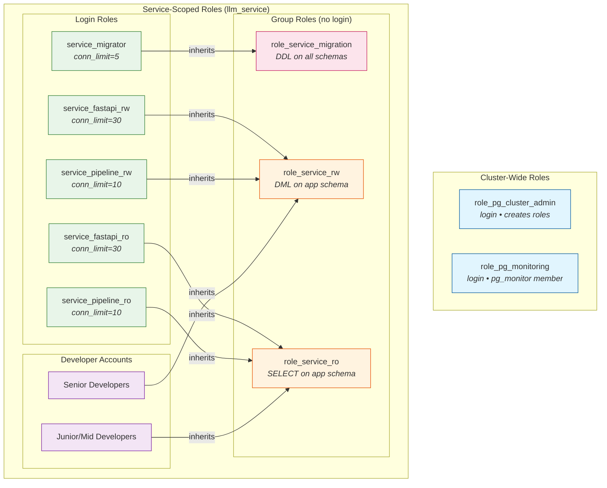
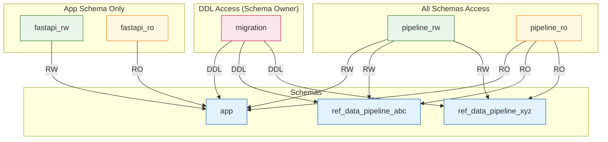

# Example: LLM Chat App Setup

This example shows how to create a comprehensive role-based access control (RBAC) setup for an LLM pattern reviewer service with multiple schemas and permission boundaries.

See [docs/llm_app_example.md](../../docs/llm_app_example.md) for the full design document.

## Prerequisites

1. **PostgreSQL running locally** (e.g., via Homebrew: `brew services start postgresql@17`)

2. **Create an admin user** with CREATEROLE privilege:
   ```bash
   psql postgres -c "CREATE ROLE admin_user LOGIN CREATEROLE PASSWORD 'insecure-pass-for-demo-admin-user';"
   ```

## Usage

```bash
cd examples/llm_chat_app

# Initialize Terraform
terraform init

# Preview the changes
terraform plan

# Apply the configuration
terraform apply
```

## Verify the Setup

After `terraform apply` succeeds, run these tests to verify the RBAC configuration.

### Set up environment

```bash
export PGHOST=localhost
export PGPORT=5432
export PGDATABASE=llm_service
```

### Quick smoke test

```bash
# Migration role can connect and create tables
PGPASSWORD=demo-password-migrator psql -U service_migrator -c "
  CREATE TABLE app.smoke_test (id serial);
  DROP TABLE app.smoke_test;
  SELECT 'Migration role works!' AS result;
"

# FastAPI RW can connect
PGPASSWORD=demo-password-fastapi-rw psql -U service_fastapi_rw -c "SELECT 1 AS connected;"

# Verify connection limits
PGPASSWORD=demo-password-migrator psql -U service_migrator -c "
  SELECT rolname, rolconnlimit
  FROM pg_roles
  WHERE rolname LIKE 'role_service_%' OR rolname LIKE 'service_%'
  ORDER BY rolname;
"
```

### Full test suite

Run the included test scripts to verify all permissions:

```bash
# Run all tests at once
./RUN_ALL_TESTS.sh

# Or run steps individually:
./1_apply_terraform.sh    # Apply the Terraform configuration
./2_create_test_objects.sh # Create test tables/views/functions
./3_run_verification_tests.sh # Verify RBAC permissions
./4_cleanup.sh            # Clean up test objects and destroy infrastructure
```

See [docs/llm_app_example.md](../../docs/llm_app_example.md) for the full design document and detailed test plan.

## Roles and Permissions

Group roles (no login) use the `role_` prefix. Login roles do not have the prefix.

| Role                     | Purpose                                            | Login | Connection Limit |
| ------------------------ | -------------------------------------------------- | ----- | ---------------- |
| `role_pg_cluster_admin`  | Creates users/roles across the cluster (Terraform) | Yes   | -                |
| `role_pg_monitoring`     | System stats access (Datadog, Grafana)             | Yes   | -                |
| `role_service_migration` | Group role that owns database, schemas, all DDL    | No    | -                |
| `service_migrator`       | Login role for CI/CD migrations                    | Yes   | 5                |
| `role_service_rw`        | Group role for read/write on `app` schema          | No    | -                |
| `role_service_ro`        | Group role for read-only on `app` schema           | No    | -                |
| `service_fastapi_rw`     | FastAPI backend with write access                  | Yes   | 30               |
| `service_fastapi_ro`     | FastAPI backend with read-only access              | Yes   | 30               |
| `service_pipeline_rw`    | Data pipeline with write access to all schemas     | Yes   | 10               |
| `service_pipeline_ro`    | Data pipeline with read-only access to all schemas | Yes   | 10               |

## Schema Access Matrix

|                     | app | ref_data_abc | ref_data_xyz |
| ------------------- | --- | ------------ | ------------ |
| service_migrator    | DDL | DDL          | DDL          |
| service_fastapi_rw  | RW  | -            | -            |
| service_fastapi_ro  | RO  | -            | -            |
| service_pipeline_rw | RW  | RW           | RW           |
| service_pipeline_ro | RO  | RO           | RO           |

**Legend:** DDL = CREATE/ALTER/DROP, RW = CRUD, RO = SELECT only

## Role Hierarchy Diagram



## Schema Access Diagram



**Key insight:** FastAPI roles are isolated to the `app` schema, while pipeline roles have access to all schemas for cross-schema data operations.

## Cleanup

To tear down the example infrastructure:

```bash
./4_cleanup.sh
```

This drops test objects and runs `terraform destroy` to remove all created roles, grants, and the database.

## Note about authentication on Mac

Some default `pg_hba.conf` Postgres settings will allow you to log into the Postgres server without ensuring a valid password. We ran into this when we installed `postgresql@17` via [Homebrew](https://brew.sh/).

If passwords aren't being checked, your `pg_hba.conf` is set to `trust` mode. To enable password verification, change `trust` to `md5` in your `pg_hba.conf`:

```bash
# Find your pg_hba.conf location
psql postgres -c "SHOW hba_file;"

# Edit it to use md5 instead of trust for non-admin users
# Then reload: brew services restart postgresql@17
```

See [examples/web_app/README.md](../web_app/README.md) for detailed `pg_hba.conf` examples.
