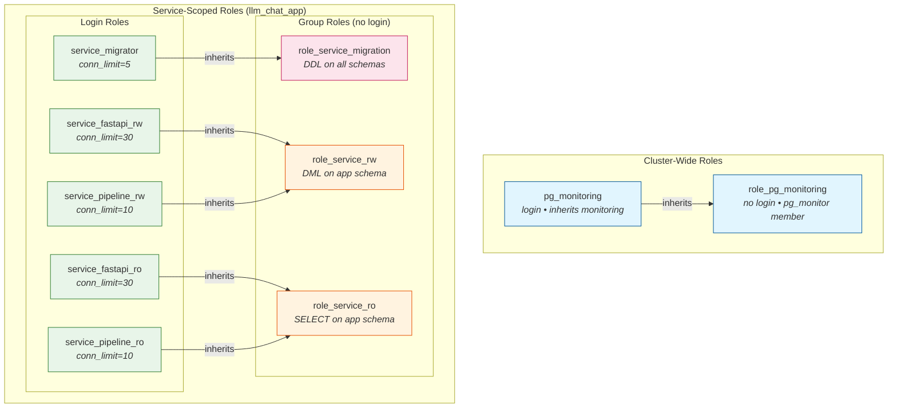
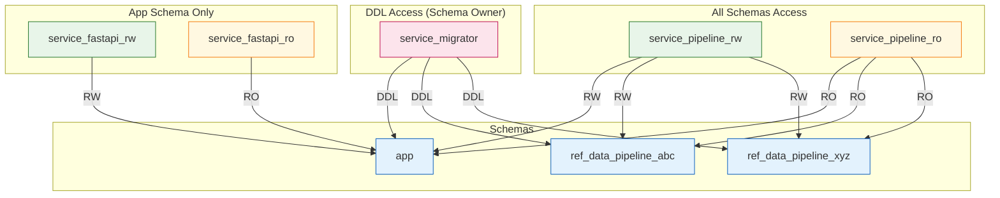

# Example: LLM Chat App Setup

This example shows how to create a comprehensive role-based access control (RBAC) setup for an LLM chat application with multiple schemas and permission boundaries.

## Prerequisites

1. **PostgreSQL running locally** (e.g., via Homebrew: `brew services start postgresql@17`)

2. **Create an admin user** with CREATEROLE privilege:
   ```bash
   psql postgres -c "CREATE ROLE admin_user LOGIN CREATEROLE PASSWORD 'insecure-pass-for-demo-admin-user';"
   psql postgres -c "GRANT pg_monitor TO admin_user WITH ADMIN OPTION;"
   ```

## Usage

```bash
cd examples/llm_chat_app

# Initialize Terraform
tofu init

# Preview the changes
tofu plan

# Apply the configuration
tofu apply
```

## Verify the Setup

After `tofu apply` succeeds, run these tests to verify the RBAC configuration.

### Quick smoke test

```bash
export PGHOST=localhost
export PGPORT=5432
export PGDATABASE=llm_chat_app

# Migration role can connect and create tables
PGPASSWORD=demo-password-migrator psql -U service_migrator -c "
  CREATE TABLE app.smoke_test (id serial);
  DROP TABLE app.smoke_test;
  SELECT 'Migration role works!' AS result;
"

# FastAPI RW can connect
PGPASSWORD=demo-password-fastapi-rw psql -U service_fastapi_rw -c "SELECT 1 AS connected;"
```

### Full test suite

```bash
# Run all tests at once
./RUN_ALL_TESTS.sh

# Or run steps individually:
./1_apply_terraform.sh         # Apply the Terraform configuration
./2_create_test_objects.sh     # Create test tables/views/functions
./3_run_verification_tests.sh  # Verify RBAC permissions
./4_cleanup.sh                 # Clean up test objects and destroy infrastructure
```

## Roles and Permissions

Group roles (no login) use the `role_` prefix. Login roles do not.

| Role                     | Type  | Purpose                                                 | Login | Connection Limit |
| ------------------------ | ----- | ------------------------------------------------------- | ----- | ---------------- |
| `role_pg_monitoring`     | Group | Holds pg_monitor membership                             | No    | -                |
| `pg_monitoring`          | Login | Datadog / Grafana login; inherits monitoring            | Yes   | -                |
| `role_service_migration` | Group | Owns schemas and all DDL                                | No    | -                |
| `service_migrator`       | Login | CI/CD migrations login                                  | Yes   | 5                |
| `role_service_rw`        | Group | Read/write on `app` schema                              | No    | -                |
| `role_service_ro`        | Group | Read-only on `app` schema                               | No    | -                |
| `service_fastapi_rw`     | Login | FastAPI backend with write access                       | Yes   | 30               |
| `service_fastapi_ro`     | Login | FastAPI backend with read-only access                   | Yes   | 30               |
| `service_pipeline_rw`    | Login | Data pipeline with write access to ref_data schemas     | Yes   | 10               |
| `service_pipeline_ro`    | Login | Data pipeline with read-only access to ref_data schemas | Yes   | 10               |

## Schemas

| Schema                  | Purpose                                                            |
| ----------------------- | ------------------------------------------------------------------ |
| `app`                   | LLM Chat Application tables (users, conversations, messages, etc.) |
| `ref_data_pipeline_abc` | Document corpus ingestion pipeline (supports RAG)                  |
| `ref_data_pipeline_xyz` | Document corpus processing pipeline (supports RAG)                 |

The `ref_data_*` schemas are managed by separate data pipelines that populate the document corpus used by the Chat Application's RAG (Retrieval-Augmented Generation) system.

## Schema Access Matrix

|                       | app | ref_data_pipeline_abc | ref_data_pipeline_xyz |
| --------------------- | --- | --------------------- | --------------------- |
| `service_migrator`    | DDL | DDL                   | DDL                   |
| `service_fastapi_rw`  | RW  | -                     | -                     |
| `service_fastapi_ro`  | RO  | -                     | -                     |
| `service_pipeline_rw` | RW  | RW                    | RW                    |
| `service_pipeline_ro` | RO  | RO                    | RO                    |

**Legend:** DDL = CREATE/ALTER/DROP, RW = CRUD, RO = SELECT only

## Role Hierarchy Diagram


```mermaid
flowchart TB
    subgraph cluster["Cluster-Wide Roles"]
        role_monitoring["role_pg_monitoring<br/><i>no login • pg_monitor member</i>"]
        pg_monitoring["pg_monitoring<br/><i>login • inherits monitoring</i>"]

        pg_monitoring -->|inherits| role_monitoring
    end

    subgraph service["Service-Scoped Roles (llm_chat_app)"]
        subgraph groups["Group Roles (no login)"]
            migration["role_service_migration<br/><i>DDL on all schemas</i>"]
            rw["role_service_rw<br/><i>DML on app schema</i>"]
            ro["role_service_ro<br/><i>SELECT on app schema</i>"]
        end

        subgraph logins["Login Roles"]
            migrator["service_migrator<br/><i>conn_limit=5</i>"]
            fastapi_rw["service_fastapi_rw<br/><i>conn_limit=30</i>"]
            fastapi_ro["service_fastapi_ro<br/><i>conn_limit=30</i>"]
            pipeline_rw["service_pipeline_rw<br/><i>conn_limit=10</i>"]
            pipeline_ro["service_pipeline_ro<br/><i>conn_limit=10</i>"]
        end
    end

    migrator -->|inherits| migration
    fastapi_rw -->|inherits| rw
    fastapi_ro -->|inherits| ro
    pipeline_rw -->|inherits| rw
    pipeline_ro -->|inherits| ro

    classDef clusterRole fill:#e1f5fe,stroke:#01579b
    classDef groupRole fill:#fff3e0,stroke:#e65100
    classDef loginRole fill:#e8f5e9,stroke:#2e7d32
    classDef migrationGroup fill:#fce4ec,stroke:#c2185b

    class role_monitoring clusterRole
    class pg_monitoring clusterRole
    class rw,ro groupRole
    class migration migrationGroup
    class migrator,fastapi_rw,fastapi_ro,pipeline_rw,pipeline_ro loginRole
```

## Schema Access Diagram


```mermaid
flowchart TB
    subgraph ddl_access["DDL Access (Schema Owner)"]
        migration["service_migrator"]
    end

    subgraph app_only["App Schema Only"]
        fastapi_rw["service_fastapi_rw"]
        fastapi_ro["service_fastapi_ro"]
    end

    subgraph all_schemas["All Schemas Access"]
        pipeline_rw["service_pipeline_rw"]
        pipeline_ro["service_pipeline_ro"]
    end

    subgraph schemas["Schemas"]
        direction LR
        app["app"]
        ref_abc["ref_data_pipeline_abc"]
        ref_xyz["ref_data_pipeline_xyz"]
    end

    migration -->|DDL| app
    migration -->|DDL| ref_abc
    migration -->|DDL| ref_xyz

    fastapi_rw -->|RW| app
    fastapi_ro -->|RO| app

    pipeline_rw -->|RW| app
    pipeline_rw -->|RW| ref_abc
    pipeline_rw -->|RW| ref_xyz

    pipeline_ro -->|RO| app
    pipeline_ro -->|RO| ref_abc
    pipeline_ro -->|RO| ref_xyz

    classDef schemaNode fill:#e3f2fd,stroke:#1565c0
    classDef ddlRole fill:#fce4ec,stroke:#c2185b
    classDef rwRole fill:#e8f5e9,stroke:#2e7d32
    classDef roRole fill:#fff8e1,stroke:#f57f17

    class app,ref_abc,ref_xyz schemaNode
    class migration ddlRole
    class fastapi_rw,pipeline_rw rwRole
    class fastapi_ro,pipeline_ro roRole
```

**Key insight:** FastAPI roles are isolated to the `app` schema, while pipeline roles have access to all schemas for cross-schema data operations.

## Cleanup

```bash
./4_cleanup.sh
```

This drops test objects and runs `tofu destroy` to remove all created roles, grants, and the database.

## Note about authentication on Mac

Some default `pg_hba.conf` Postgres settings will allow you to log into the Postgres server without ensuring a valid password. We ran into this when we installed `postgresql@17` via [Homebrew](https://brew.sh/).

If passwords aren't being checked, your `pg_hba.conf` is set to `trust` mode. To enable password verification, change `trust` to `md5` in your `pg_hba.conf`:

```bash
# Find your pg_hba.conf location
psql postgres -c "SHOW hba_file;"

# Edit it to use md5 instead of trust for non-admin users
# Then reload: brew services restart postgresql@17
```

See [examples/web_app/README.md](../web_app/README.md) for detailed `pg_hba.conf` examples.
